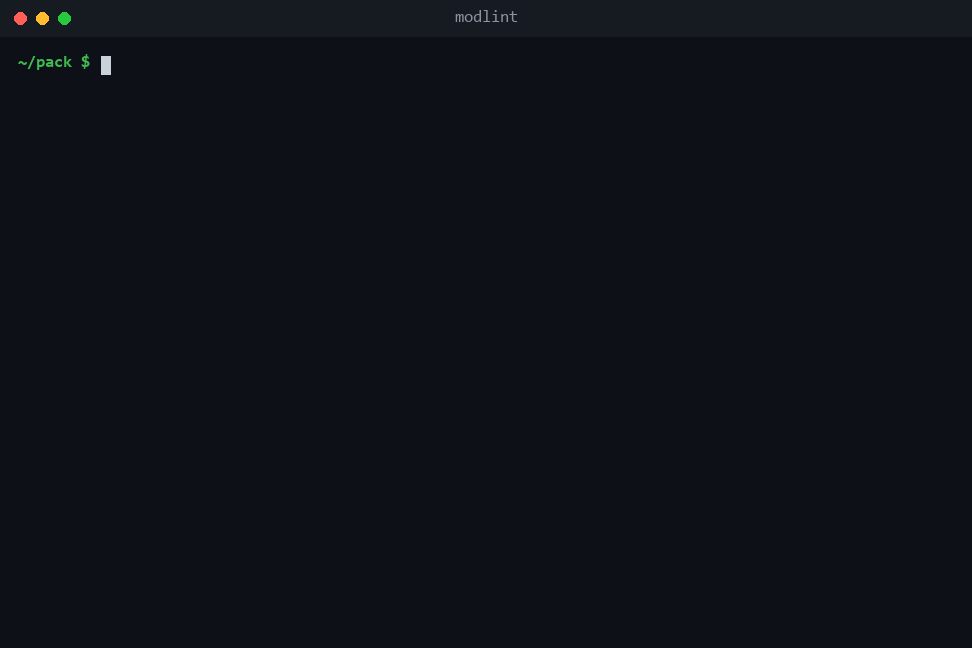

# ModLint

[](https://github.com/Basinity/ModLint/actions/workflows/build.yml)

Find mod conflicts before the game does.

ModLint statically analyzes a Minecraft mods folder (Fabric, Forge, or NeoForge) or a Modrinth `.mrpack` file and reports what will break the pack: missing dependencies, failed version ranges, wrong-loader jars, overlapping Mixins, silent resource overrides, clashing bundled libraries, and combinations known to be incompatible. All of it in one report, before the game is ever launched. Think of it as LOOT (the load-order tool for Bethesda games), for Minecraft.

Try it in the browser at [modlint.basinity.com](https://modlint.basinity.com), or run the CLI locally.



ModLint only reads the jars. It never loads or executes mod code, and it does not need a game installation.

## Why

The existing tools around this problem are narrow. Registry-ID conflict viewers catch one clash type. Pack compatibility checkers compare an author-declared version. Crash analyzers only help after the game has already crashed. Nothing inspects a folder of mods statically and surfaces the whole class of pre-launch problems in one pass. That is the space ModLint fills.

## What it detects

| Finding type | What it catches | Severity |
|---|---|---|
| `missing-dependency` | A mod's declared required dependency is not in the set | High |
| `version-range-violation` | A dependency is present, but its version fails the declared range (including Minecraft, the loader, and Fabric API) | High |
| `wrong-loader` | A jar built for a different loader than the pack targets | High |
| `duplicate-mod-id` | Two jars provide the same mod id | High |
| `declared-incompatibility` | A mod declares `breaks` or `conflicts` against another installed mod | High / Medium |
| `resource-override` | Two mods ship the same file under `assets/` or `data/`, where the last one loaded silently wins | Medium |
| `bundled-library-clash` | Two mods bundle different versions of the same library via Jar-in-Jar | Medium |
| `access-widener-conflict` | Two mods widen the same class member in ways that diverge | Low |
| `mixin-overlap` | Two mods inject intrusively into the same method | Potential |
| `known-bad-combination` | A curated masterlist rule matches: a combination documented to break, with a suggested fix | Per rule |

Every finding carries the mods involved, a plain explanation of the problem, and a suggested fix.

"Potential" is its own severity tier for heuristic findings: high impact if real, but the overlap alone does not prove breakage, so they are grouped separately and are easy to suppress.

Paths the game merges by design (lang files, data tags, Forge's global loot modifiers) are excluded from the resource-override pass, so merged content does not show up as a conflict.

## Using the CLI

Requires Java 21.

```
./gradlew installDist
build/install/modlint/bin/modlint <mods-folder or pack.mrpack>
```

On Windows, use `gradlew.bat` and `modlint.bat`.

Examples:

```
# Analyze a mods folder, checking Minecraft version pins against 1.20.1
modlint path/to/mods --mc-version 1.20.1

# Machine-readable report
modlint path/to/mods --mc-version 1.20.1 --json

# Analyze a Modrinth pack file directly; the mods are downloaded sha1-verified,
# and the pack's declared Minecraft version and loader are used automatically
modlint pack.mrpack
```

Options:

- `--mc-version <version>`: the Minecraft version to check `minecraft` dependency ranges against. For an `.mrpack`, defaults to the version declared in the pack.
- `--loader fabric|forge|neoforge`: forces the analysis target. Without it, the loader most jars carry metadata for wins (an `.mrpack` uses its declared loader).
- `--json`: emit the report as JSON instead of text. The shape is stable and identical to what the web API returns.
- `--ignore <file>`: suppress findings, one rule per line: a finding type from the table above, optionally followed by a mod id or file name. A `.modlintignore` file next to the target is picked up automatically.
- `--rules <file>`: an extra masterlist YAML of known-bad combinations, layered on top of the bundled one.

Exit codes make it usable as a CI gate for pack authors:

| Code | Meaning |
|---|---|
| 0 | no findings |
| 1 | findings reported |
| 2 | usage or input error |

## Web UI

The same engine behind a browser front-end: drop a mods folder or a zip of jars, get the report rendered filterable, each finding expandable to show the why and the fix. `POST /api/analyze` answers with exactly the JSON the CLI emits under `--json`, so the two front-ends cannot drift apart.

Run it locally (building the UI needs Node and npm on top of the JDK):

```
./gradlew serverJar
java -jar build/libs/modlint-server-<version>.jar
```

It binds to `127.0.0.1:8080`; override with the `MODLINT_HOST` and `MODLINT_PORT` environment variables.

Uploads are analyzed in memory and discarded, never stored. Analysis reads metadata and bytecode with ASM and never loads uploaded classes, so a malicious jar cannot run on the server by being analyzed. `.mrpack` input is deliberately CLI-only: materializing one server-side would mean downloading arbitrary URLs out of an uploaded index.

## How it works

A jar reader parses each mod's metadata (`fabric.mod.json`, `mods.toml`, `neoforge.mods.toml`), enumerates its `assets/` and `data/` paths, walks nested Jar-in-Jar libraries (Fabric's declared `jars` and Forge's `jarjar/metadata.json`), and reads Mixin configs and access wideners. Everything normalizes into one loader-agnostic model, so the analysis passes do not care which loader a mod was written for.

Analysis runs under a single target loader, auto-detected as the one most jars carry metadata for. Version ranges are evaluated in the declaring loader's own dialect, using the loaders' own libraries: fabric-loader's version predicates for Fabric mods, maven-artifact's ranges for Forge and NeoForge mods. A NeoForge target accepts plain Forge metadata through Minecraft 1.20.x, matching NeoForge's own compatibility window.

The dependency resolver models what the loader actually resolves rather than raw jar contents. Where several jars provide the same id, only the one the loader would load (the highest version) is judged, so a stale bundled copy cannot invent a conflict. Two things are never judged at all, because a mods folder cannot reveal the answer: the `mixinextras` id, which fabric-loader bundles itself, and any dependency restricted to a single side (client/server), since a folder does not say which side it is.

Compatibility layers are respected: when Kilt or Sinytra Connector is present, a foreign-loader jar is intentional and the wrong-loader pass stays quiet about it.

### The Mixin overlap heuristic

Mixin conflicts are the failures modpack builders fear most, and the least visible before launch. ModLint reads each mod's Mixin config JSONs (including those named in a `MixinConfigs` manifest attribute or a NeoForge `[[mixins]]` table), then uses ASM to read the injector annotations on the referenced classes. Only intrusive injectors count: `@Overwrite`, `@Redirect`, `@ModifyConstant`, and `@ModifyArg(s)`, the ones where two mods touching the same code are fragile together. `@Inject` is excluded because it composes. When two mods target the same class and method intrusively, that overlap is flagged as a potential finding: a real risk, not a proven crash, which is exactly what the severity tier says.

## The masterlist

Some incompatibilities cannot be derived from metadata: `breaks` declarations are frozen in the jar at release time, abandoned mods never ship another release, and "you also need X alongside Y" is not expressible in mod metadata at all. Those live in a curated YAML masterlist, bundled at `src/main/resources/modlint/masterlist.yaml`, LOOT-style.

```yaml
rules:
  - id: continuity-old-sodium-without-indium
    mods:
      continuity: "*"
      sodium: "<0.6.0"
    absent:
      - indium
    severity: high
    problem: "Sodium below 0.6.0 does not implement the Fabric Rendering API that Continuity renders through, so connected textures silently fail or crash without the Indium bridge."
    fix: "Install Indium, or update Sodium to 0.6.0 or newer."
```

A rule fires when every listed mod is installed in a matching version and none of the `absent` ids is present. Contributions are welcome via pull request: keep entries to combinations that are documented or reproducible, and say what to do instead in `fix`. A rule that becomes redundant because the mods start declaring the conflict themselves gets deleted.

## Validation

The bar the detectors are held to: no high-severity finding may fire on a pack that actually works, because a working pack is a known-good answer key. That is checked against real packs, not fixtures alone: a production 100-mod 1.20.1 server pack and around 700 jars across thirteen launcher instances (Fabric packs from 1.16 onward plus a large Forge pack) all come back with zero high findings, and everything reported is either a true fact about the pack or an explicitly heuristic potential finding. A deliberately broken pack in the integration tests fires every finding type.

## Limitations

ModLint is a pre-launch check, not a guarantee. Static analysis cannot observe true Mixin apply order or runtime registry state, and the Mixin overlap pass is a heuristic by design. Quilt-only jars are detected, and Quilt packs analyze as Fabric; Quilt as its own analysis target is on the list.

## Building

```
./gradlew build
```

Requires JDK 21. Node and npm are only needed for the `serverJar` task, which bundles the browser UI; plain builds and tests stay npm-free.

## License

MIT, see [LICENSE](LICENSE).
